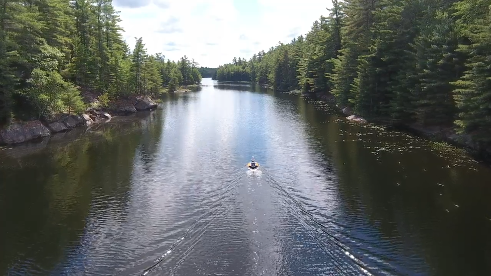
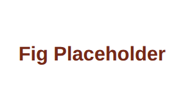
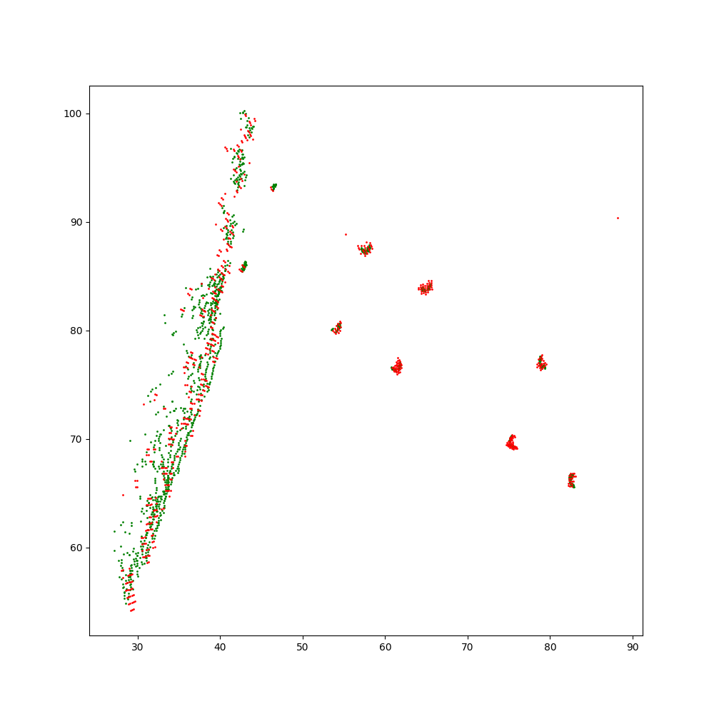

# A Guide to the CANOE dataset

## Introduction

### Purpose
This dataset is intended to support autonomous navigation systems for marine robotics.
It features a unique and rich sensor suite, with 
radar, lidar, vision, sonar, motor, and imu data captured over multiple traversals of a lake and reservoir.
The canoe dataset can be used, for example, to benchmark the odometry and localization capabilities of various sensor types for aquatic navigation.
In the future, we plan to release benchmarks and leaderboards for these tasks.



### Sensors
- Navtech 360 degree radar
- 128-beam Ouster 3D lidar with integrated IMU
- Teledyne bumblebee stereo camera
- Oculus M3000d imaging sonar
- Motor power inputs
- Novatel OEM7 GNSS

[TODO: Add sidescan]: #

**Data Collection Apparatus**: 


### Data Collection
Data was collected on a lake and reservoir in Ontario, Canada over the course of three days. 
On the lake, A "short" and "long" route were each traversed twice, with the long route covering the full length of the lake. 
The reservoir path was repeated three times.
In total, over 14 hours and 20 km of data were collected.
These routes are shown below:

")**Route Overlay on Satellite Image**


## Sensor Details
### Specifications

**Lidar**: The Ouster-OS1 128-beam lidar has a 45 degree vertical field of view, with a range of up to 90m for targets with 10\% reflectivity. 
This lidar has a 0.35 degree vertical angular resolution and a 0.35 degree horizontal angular resolution (1024 pulse/rotation).
The lidar is configured to have a rotational rate of 10Hz, resulting in over 100k points per rotation. 
This sensor typically produces over 1M points per second. 
We retain only the strongest lidar returns instead of keeping dual returns per laser firing sequence.

**Radar**: The Navtech RAS6 radar can operate in multiple range modes, each with a different range resolution and maximum range.
The primary radar configuration has range resolution of 0.292m per range bin with a total range of 1km. 
The secondary radar mode has a range resolution of 0.0438m per range bin and a maximum range of 150m.
The sensor spins at 4Hz and provides 400 azimuth measurements per rotation, resulting in a horizontal angular resolution of 0.9 degrees.

**Stereo Camera**: The Teledyne Bumblebee stereo camera records 
synchronized camera feeds from the left and right camera, 
each with a resolution of 1152 $\times$ 2048.
We store rectified images that have been unwarped according to the manufacturer-provided warping tables. 
Images are extracted and stored at 10Hz to minimize storage requirements.

**Sonar**: The Oculus M3000d imaging sonar provides a 2D image from 512 beam measurements, covering a 130 degree field of view. 
It operates at a frequency of 1.2 MHz, with a maximum range of 30m and 378 range bins.
Sonar images are recorded at a rate of approximately 14Hz. 

**IMU**: The inertial measurement unit (IMU) is integrated into the Ouster OS1 lidar. 
It records angular velocities and linear accelerations in the x, y, and z directions, without biases removed.
IMU measurements are recorded at a rate of 100Hz

**Motors**: 
The left (port) and right (starboard) motor power inputs are reported in Watts at a rate of 2.5 Hz. 


**GPS**: 
The NovAtel GNSS system includes dual OEM7 receivers and a dedicated IMU.
The recorded GNSS data is post-processed using the proprietary Inertial Explorer suite, which retrieves base station data and performs tightly-coupled batch optimization over each sequence. 
The post-processed position data can be expected to have an RMS error of approximately 2–4 cm. 
Post-processed positions and velocities are provided, interpolated to 1000 Hz.

### Placement
**Sensor Placement**


## Data Organization
Each sequence is stored as a folder under a single Amazon S3 bucket and follows the same naming convention: `s3://canoe/canoe-YYYY-MM-DD-HH-MM` denoting the time that data collection started. Below is an overview of the structure of each sequence:

```text
canoe-YYYY-MM-DD-HH-MM/
    calib/
        P_cam.txt
        radar_config.yaml
        T_sens2_sens1.txt
    novatel/
        novatel_imu.csv
        novatel_original.csv
        <sens>_poses.csv
    cam_left/
        <timestamp>.png
    cam_right/
        <timestamp>.png
    imu/
        imu.csv
    lidar/
        <timestamp>.bin
    motor/
        power.csv
    radar/
        <timestamp>.png
    sonar/
        <timestamp>.png
    cam.mp4
    dashboard.mp4
    route_map.html
```

Accessing and downloading the dataset is best done using the AWS CLI. 
The main S3 bucket can also be browsed through using the S3 console in your internet browser at: 

[`https://s3.console.aws.amazon.com/s3/buckets/canoe-data/`](https://s3.console.aws.amazon.com/s3/buckets/canoe-data/)


### Download Instructions
1. [Create an AWS account (optional)](https://aws.amazon.com/premiumsupport/knowledge-center/create-and-activate-aws-account/)
2. [Install the AWS CLI](https://docs.aws.amazon.com/cli/latest/userguide/install-cliv2.html)
3. Create a `root` folder to store the dataset, example: `/path/to/data/canoe/` Each sequence will then be a folder under `root`.
4. Use the AWS CLI to download either the entire dataset or only the desired sequences and sensors. Add `--no-sign-request` after each of the following commands if you're not going to use an AWS account. For example, the following command will download the entire canoe dataset: 

```bash
root=/path/to/data/canoe/
aws s3 sync s3://canoe $root
```

The following command will list all the top-level prefixes (sequences):

```bash
root=/path/to/data/canoe/
aws s3 ls s3://canoe
```
Alternatively, [our website (work-in-progress)](canoe.utias.utoronto.ca/#/download) can be used to browse through sequences as well as pick and choose what data to download. 
The website will then generate a list of AWS CLI commands that can be run as a bash script. 
These commands will look something like:

```bash
root=/path/to/data/canoe/
cd $root
aws s3 sync s3://canoe/canoe-2025-08-21-18-15 ./canoe-2025-08-21-18-15
```

### Timestamps

For camera, lidar, radar, and sonar files, the name of each file corresponds to its timestamp. 
These timestamps are given as the number of microseconds since January 1st, 1970, in UTC time.
For lidar and radar scans, the file timestamp corresponds with the temporal middle of the scan: `floor(M / 2) - 1` where `M` is the total number of azimuths.
Further, each lidar point and radar azimuth has a timestamp associated with it, expressed in seconds for lidar and microseconds for radar.
Imu measurements and motor inputs are each recorded in a csv file with the timestamps recorded in the first column.


## Conventions
We follow the convention used at University of Toronto Institute for Aerospace Studies (UTIAS) for describing rotations, translations, and transformation matrices. See [State Estimation (Barfoot, 2017)](http://asrl.utias.utoronto.ca/~tdb/bib/barfoot_ser17.pdf) for more details.


## File Formats
### Lidar
Lidar pointclouds are stored with a custom numpy data type and saved in binary format to minimize storage requirements.
Each point has seven fields: `[x, y, z, i, t, r, a]`
where `(x, y, z)` is the position of the point with respect to the lidar, 
`i` is the intensity of the reflected infrared signal, 
`t` is the point timestamp expressed in seconds, 
`r` is the reflectivity of the signal (intensity normalized by distance), 
`a` is the ambient near infrared signal measured when the sensor is not firing.

The following code snippet can be used to convert a binary file into a numpy array (N, 7): 

```Python
import numpy as np

def load_lidar(path):
    """Load LiDAR pointcloud (N,7) (np.ndarray, np.float64) from path."""
    # Custom lidar data storage type
    bin_dtype = np.dtype(
        [
            ("x", np.float64),
            ("y", np.float64),
            ("z", np.float64),
            ("intensity", np.uint16),
            ("timestamp", np.uint64),
            ("reflectivity", np.uint16),
            ("ambient", np.uint16),
        ]
    )
    data = np.fromfile(path, dtype=bin_dtype)
    points = np.stack(
        (
            data["x"],
            data["y"],
            data["z"],
            data["intensity"].astype(np.float64),
            np.round(data["timestamp"].astype(np.float64)/1e6,6), #micro to sec
            data["reflectivity"].astype(np.float64),
            data["ambient"].astype(np.float64),
        ),
        axis=1,
    )
    return points
```

**Lidar Visualization**

### Radar
Raw radar scans are 2D polar images: `M` azimuths x `R` range bins. 
We follow Oxford's convention and embed timestamp and encoder information into the first 11 columns (bytes) of each polar radar scan. 
The first 8 columns represent a 64-bit integer, the UTC timestamp of each azimuth. 
The next 2 columns represent a 16-bit unsigned integer, the rotational encoder value. 
The encoder values can be converted into azimuth angles in radians with: `azimuth = encoder * np.pi / 2800`. 
The next column is unused to preserve compatibility with Oxford's format. 
For convenience, we also provide SDK functionality to convert the provided polar format into a cartesian representation.

**Radar Vis: Polar & Cart**

### Camera
Images are stored as `png` files. 
All images are rectified such that a simple projection matrix can be used to project lidar points onto an image.
Left and right images have matching timestamps.

**Camera Visualization**

### Sonar
Similar to the radar sensor, raw sonar scans are 2D polar images: `M` azimuths x `R` range bins. 
The first two *rows* represent the rotational encoder value as a 16-bit *signed* integer.
The encoder values can be converted into azimuth angles in radians with: `azimuth = encoder * 0.01 * np.pi/180`. 
We provide SDK functions to convert the provided polar format into a cartesian representation.

**Sonar Visualization (Polar and cart)**

### IMU
All IMU measurements for a sequence are recorded in a single csv file, `imu/imu.csv`, with one row per reading. 
Each IMU measurement has seven fields: `time,wx,wy,wz,ax,ay,az`, 
where `time` is the UTC timestamp in microseconds, `(wx, wy, wz)` is the angular acceleration, and `(ax, ay, az)` is the linear acceleration.


### Motor Inputs
All motor power inputs for a sequence are recorded in `motor/power.csv`. 
Each row has four fields: `time,starboard,port,total`, 
where `time` is the UTC timestamp in microseconds, 
`starboard` and `port` are the power values (in Watts) to the right and left motors, respectively, 
and `total` is the total power supplied to the boat in Watts.


### Pose Files

Ground truth poses are obtained by post-processing GNSS and IMU measurements along with corrections from base station data using Novatel's Inertial Explorer software suite.

Positions and velocities are given with respect to a fixed East-North-Up frame $ENU_{\text{ref}}$. 
The position of the $ENU_{\text{ref}}$ frame is chosen near the start of the first sequence. 
The orientation of $ENU_{\text{ref}}$ is defined as as the ENU (x points East, y points North, z points Up) frame tangential the WGS-84 ellipsoid at that specific position (i.e., latitude, longitude, altitude).

For each sequence, `novatel/novatel_original.csv` contains the post-processed ground truth in the Novatel frame interpolated to 1000Hz. 
Each sensor frame's pose and velocity information is stored in the associated `novatel/<sens>_poses.csv`, interpolated to the sensor timestamps, with the following format:
`t, x, y, z, r, p, y, vx, vy, vz, wx, wy, wz, vx_bod, vy_box, vz_bod`, 
where 
* `t` is the UTC time in microseconds corresponding to the sensor timestamp, 
* `(x, y, z)` is position of the sensor $s$ with respect to the $ENU_{\text{ref}}$ frame expressed in $ENU_{\text{ref}}$, 
* `(r, p, y)` are the xyz angles from sensor to $ENU_{\text{ref}}$ that can be converted into the rotation matrix from sensor to $ENU_{\text{ref}}$ ($C_{es}$) using a 3-2-1 principal rotation sequence,
* `(vx, vy, vz)` is the linear velocity of the sensor with respect to $ENU_{\text{ref}}$ expressed in $ENU_{\text{ref}}$ ($v^{se}_e$),
* `(wx, wy, wz)` is the angular velocity of the sensor with respect to $ENU_{\text{ref}}$ expressed in the sensor frame ($\omega^{se}_s$),and
* `(vx_bod, vy_box, vz_bod)` is the linear velocity of the sensor with respect to $ENU_{\text{ref}}$ expressed in the sensor frame ($v^{se}_s$).

The pose of the sensor frame is then:
```Python
import numpy as np
from pycanoe.utils.utils import C1, C2, C3

def get_pose(x, y, z, r, p, y):
    T_enuref_sens = np.eye(4)

    C_enuref_sens = C1(r) @ C2(p) @ C3(y)
    T_enuref_sens[0:3, 0:3] = C_enuref_sens  

    r_sens_enuref_in_enuref = np.array([x, y, z])
    T_enuref_sens[0:3, 3] = r_sens_enuref_in_enuref

    return T_enuref_sens
```

We also provide `novatel_imu.csv`. 
This data is provided in the novatel reference frame.
Each line has the following format: `t,wx,wy,wz,ax,ay,az`, 
where `t` is the timestamp in microseconds, 
`(wx, wy, wz)` is the angular velocity of the IMU and
`(ax, ay, az)` is the linear acceleration as defined in the novatel frame.
**NOTE**: The novatel reference frame defines x facing right, y facing forward, and z facing up.

## Synchronization and Calibration
### Synchronization
Most sensors in the suite are synchronized to UTC time using individual PTP connections.
Each sensor has an individual PTP  
**TODO** Expand on synchronization.

### Camera
The camera warp table, intrinsics (focal length, principle point), and extrinsic transformation (i.e., baseline) between the left and right camera were provided by Teledyne.
Images in the dataset have already been rectified and as such, the intrinsics parameters can be ignored for most applications. 
The rectified matrix `P` (from which the intrinsics can be extracted), stored in `P_cam.txt`, can then use used to project points onto the image plane.

### Lidar-to-Camera Extrinsics
The extrinsic calibration between the left camera and lidar is obtained using [MATLAB's camera to LIDAR calibrator](https://www.mathworks.com/help/lidar/ug/lidar-and-camera-calibration.html). The results are stored in `T_cam_lidar.txt`.

**Lidar-Camera Calibration Verification Image**

### Radar
A range gain and offset can be used to calculate the most accurate range values from the radar. 
These values were provided by the radar manufacturer (Navtech).
The gain, offset, and maximum range mode (from which the range resolution can be calculated) for each sequence is available in `radar_config.yaml`.

### Lidar-to-radar
The lidar and radar sensors are stacked vertically. 
Calibration is performed to optimize the 3D rotation (primarly yaw) between these two sensors. 
Targets are extracted from the point clouds of temporally-aligned (<0.001 second separation) lidar and radar scans,
and a Gauss-Newton optimization is performed that minimizes the nearest neighbour distance between targets.
The result is stored in T_lidar_radar.txt

***TODO***: Verify procedure

**Lidar-Radar Calibration Verification Image**

### Other Extrinsic Calibration
The remaining extrinsic calibration was performed either via the boat CAD model (boat-lidar), measured manually (boat-sonar), or provided by the manufacturer (lidar-imu).


----------------------------------------

### Lidar-to-Radar Extrinsics
To calibrate the rotation between the lidar and radar, we use correlative scan matching via the Fourier Mellin transform: [git repo](https://github.com/keenan-burnett/radar_to_lidar_calib). Several lidar-radar pairs are collected while the vehicle is stationary in different positions. The final rotation estimate is obtained by averaging over several measurements. The results are stored in `T_radar_lidar.txt`.


